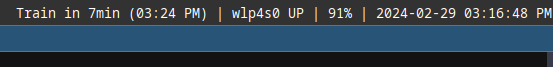

# SWAY BAR STATUS LINE



## Configuration

Copy the example.config.yml file to `$HOME/.config/swaybar/config.yml` and modify as required.
You can also use the `SWAYBAR_CONFIG_LOCATION` environment variable to set the config location.

## PTV Support

Ensure you have the following authentication keys defined.

```bash
export PTV_DEVID=MY_DEV_ID
export PTV_KEY=MY_DEV_KEY
```
